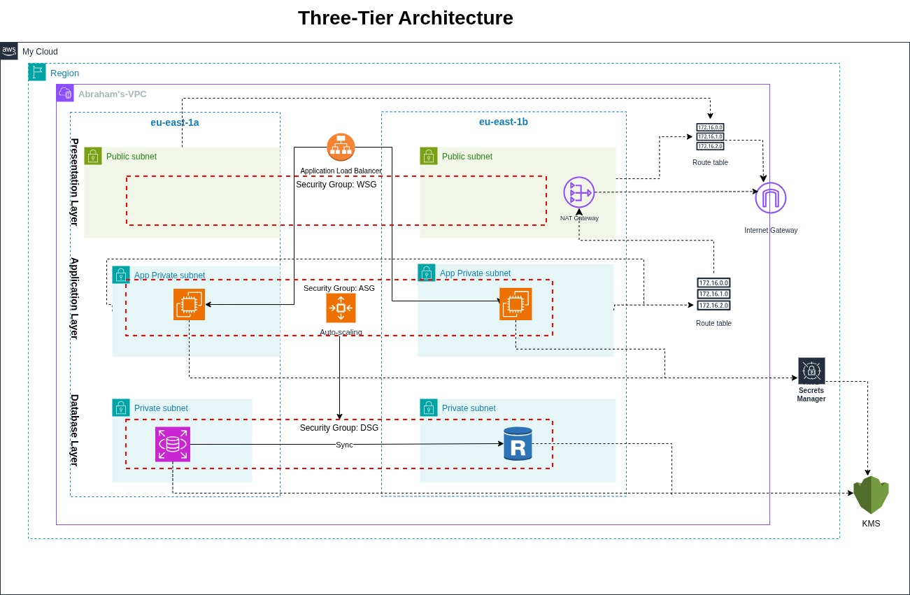

# 3-Tier AWS Architecture with Terraform Modules

## 🏗️ Architecture Overview

This project provisions a 3-tier AWS architecture using Terraform native modules with **enterprise-grade security features**:

### **Presentation Layer (Public)**
- Application Load Balancer (ALB) in public subnets
- HTTPS support with ACM certificate (optional)
- HTTP to HTTPS redirect capability

### **Application Layer (Private)**
- Auto Scaling Group with 2 EC2 instances (t3.micro)
- IAM roles with least-privilege access
- Secrets Manager integration for secure credential retrieval
- SSM Session Manager for secure access (no SSH keys needed)

### **Data Layer (Private)**
- RDS MySQL (db.t3.micro) Multi-AZ for high availability
- Customer-managed KMS encryption at rest
- Automated backups (7-day retention)
- Secrets Manager for credential management

### **Security Enhancements**
- ✅ AWS KMS for encryption (RDS, Secrets Manager)
- ✅ AWS Secrets Manager for automatic password generation
- ✅ IAM roles with least-privilege policies
- ✅ No hardcoded credentials in code
- ✅ Multi-AZ RDS for fault tolerance
- ✅ Single NAT Gateway for cost optimization

All resources are parameterized, tagged, and region-restricted (eu-west-1, eu-central-1, us-east-1).

---


## How It Works - Traffic Flow

### **Step-by-Step Traffic Flow**

```
Internet → Internet Gateway → ALB (Public Subnets) → EC2 App Servers (Private Subnets) → RDS MySQL (Private DB Subnets)
```

1. **User Request Enters**
   - External user sends HTTP/HTTPS request
   - Traffic enters through **Internet Gateway (IGW)**

2. **Presentation Layer (Public)**
   - **Application Load Balancer (ALB)** in public subnets receives traffic
   - ALB protected by **Web Security Group** (allows ports 80/443 from internet)
   - ALB performs health checks and load balancing across AZs

3. **Application Layer (Private)**
   - ALB forwards traffic to **EC2 instances (t3.micro)** in private app subnets
   - EC2 protected by **App Security Group** (only accepts traffic from ALB)
   - Application processes request and queries database

4. **Data Layer (Private)**
   - EC2 connects to **RDS MySQL** in private DB subnets
   - RDS protected by **DB Security Group** (only port 3306 from App tier)
   - Database returns data to application

5. **Response Path**
   - Data flows back:  RDS → EC2 → ALB → IGW → User

6. **Outbound Internet Access**
   - Private subnets route outbound traffic through **NAT Gateway**
   - NAT Gateway in public subnet enables updates/patches
   - No inbound connections allowed from internet

### **Security Design**
- **3 isolated layers**:  Public → Private App → Private DB
- **Defense in depth**: Security groups at each tier allow only necessary traffic
- **Multi-AZ**:  All components span 2 Availability Zones for high availability
- **Zero trust**: Each layer only trusts the layer directly above it

### **Key Benefits**
✅ Scalable and fault-tolerant  
✅ Database never exposed to internet  
✅ Application servers in private subnets  
✅ Load balancing across multiple AZs  
✅ Secure, production-ready architecture

---

## Folder Structure

```
IaC/
├── main.tf                    # Main configuration
├── provider.tf                # AWS provider & backend config
├── variables.tf               # Input variables
├── outputs.tf                 # Output values
├── terraform.tfvars           # Variable values (gitignored)
├── .gitignore                 # Excludes secrets & state files
├── modules/
│   ├── kms/                   # 🆕 KMS encryption keys
│   ├── secrets/               # 🆕 Secrets Manager
│   ├── iam/                   # 🆕 IAM roles & policies
│   ├── networking/            # VPC, subnets, NAT, IGW
│   ├── security/              # Security groups
│   ├── alb/                   # Application Load Balancer
│   ├── compute/               # EC2 Auto Scaling Group
│   └── database/              # RDS MySQL
└── docs/
    ├── ARCHITECTURE_ENHANCED.md    # Enhanced architecture diagram
   
```

---

## 🚀 Deployment Instructions

### Prerequisites
- AWS CLI configured with appropriate credentials
- Terraform v1.0 or later
- (Optional) ACM certificate ARN for HTTPS

### Step 1: Initialize Terraform
```bash
cd IaC
tf init
```

### Step 2: Review Variables
Edit `terraform.tfvars` if needed:
```hcl
db_username = "admin"  # Database username (password auto-generated)
# certificate_arn = "arn:aws:acm:..." # Optional: for HTTPS
```

### Step 3: Plan Deployment
```bash
tf plan
```
Expected: ~55 resources to be created

### Step 4: Deploy Infrastructure
```bash
tf apply
```
Type `yes` when prompted. Deployment takes **8-12 minutes**.

### Step 5: Get Outputs
```bash
tf output
```

You'll receive:
- `alb_dns` - Application URL
- `rds_endpoint` - Database endpoint
- `secret_name` - Secrets Manager secret name
- `rds_kms_key_id` - KMS key for RDS

---

## 🔐 Security Features

### AWS KMS (Key Management Service)
```
✓ Dedicated encryption keys for RDS, Secrets Manager, EBS
✓ Customer-managed keys (not AWS-managed)
✓ Automatic key rotation enabled
✓ Keys aliased for easy identification
```

### AWS Secrets Manager
```
✓ Auto-generated 24-character strong passwords
✓ Encrypted with KMS
✓ No credentials in code or Git
✓ 7-day recovery window
✓ API-driven access only
```

### IAM Roles & Policies
```
✓ EC2 instances have least-privilege IAM roles
✓ Can read from Secrets Manager
✓ Can decrypt with KMS
✓ SSM Session Manager access enabled
✓ No hardcoded AWS credentials needed
```

### Retrieve Database Password
```bash
# Get secret value
aws secretsmanager get-secret-value \
  --secret-id 3tier-iac-db-credentials \
  --query SecretString --output text | jq .

# Get just the password
aws secretsmanager get-secret-value \
  --secret-id 3tier-iac-db-credentials \
  --query SecretString --output text | jq -r '.password'
```

### Access EC2 Instances (No SSH Keys)
```bash
# List instances
aws ec2 describe-instances \
  --filters "Name=tag:Name,Values=3tier-app-instance" \
  --query 'Reservations[*].Instances[*].[InstanceId,PrivateIpAddress]' \
  --output table

# Connect via Session Manager
aws ssm start-session --target <instance-id>
```

---

## 📋 Module Descriptions

| Module | Purpose | Key Resources |
|--------|---------|---------------|
| **kms** | Encryption keys | 3 KMS keys (RDS, Secrets, EBS) + aliases |
| **secrets** | Credential management | Random password, Secrets Manager secret |
| **iam** | Access control | EC2 role, policies for Secrets/KMS/SSM |
| **networking** | Network infrastructure | VPC, 6 subnets, IGW, NAT, route tables |
| **security** | Network security | 3 security groups (web, app, db) |
| **alb** | Load balancing | ALB, target group, HTTP/HTTPS listeners |
| **compute** | Application tier | Launch template, ASG (2 instances) |
| **database** | Data persistence | RDS MySQL Multi-AZ, KMS encrypted |

---

## 📊 Variables

### Root Variables (variables.tf)
```hcl
aws_region              # Region (eu-west-1, eu-central-1, us-east-1)
azs                     # Availability zones
vpc_cidr                # VPC CIDR block
public_subnet_cidrs     # Public subnet CIDRs
private_app_subnet_cidrs # App subnet CIDRs
private_db_subnet_cidrs # DB subnet CIDRs
environment             # Environment tag (dev/prod)
project                 # Project name
owner                   # Owner tag
db_username             # Database username (admin)
certificate_arn         # Optional: ACM cert for HTTPS
```

**Note:** `db_password` is now **auto-generated** by Secrets Manager - no need to set it!

---

## 📤 Outputs

```hcl
alb_dns                 # Application Load Balancer DNS name
rds_endpoint            # RDS MySQL endpoint
asg_name                # Auto Scaling Group name
launch_template_id      # EC2 Launch Template ID
secret_name             # Secrets Manager secret name
rds_kms_key_id          # KMS key ID for RDS encryption
ec2_instance_profile    # IAM instance profile name
```


## 🏗️ Architecture Diagram

### High-Level Architecture
```
Internet → ALB (HTTPS) → EC2 Instances → RDS MySQL (Primary + Read Replica)
                          ↓
                    Secrets Manager (KMS encrypted)
                          ↓
                    IAM Role → EC2
```

### Detailed Architecture Diagram



---

## 🔍 Testing & Verification

### Test Application
```bash
# Get ALB DNS
ALB_DNS=$(tf output -raw alb_dns)

# Test health endpoint
curl http://$ALB_DNS/health

# Test application
curl http://$ALB_DNS/
```

### Verify Database Connection
The application homepage will show:
```
✅ Connected to RDS MySQL Database!
Database: db-3tier.xxxxx.rds.amazonaws.com
Server: ip-10-0-xx-xxx
```

### Verify Security
```bash
# Check secret exists
aws secretsmanager describe-secret --secret-id 3tier-iac-db-credentials

# Check KMS keys
aws kms list-aliases | grep 3tier-iac

# Check IAM role
aws iam get-role --role-name 3tier-iac-ec2-role
```

---

## 🛡️ Security Best Practices Implemented

- ✅ No passwords in code or Git history
- ✅ Secrets encrypted at rest with KMS
- ✅ RDS encrypted with customer-managed keys
- ✅ Multi-AZ for high availability
- ✅ Automated backups enabled
- ✅ Least-privilege IAM policies
- ✅ Private subnets for app and database
- ✅ Security groups with minimal access
- ✅ State files excluded from Git
- ✅ SSM Session Manager (no SSH keys)

---

## 🧹 Cleanup

To destroy all resources:
```bash
tf destroy
```

Type `yes` when prompted. All resources will be deleted.

**Note:** Secrets Manager secrets have a 7-day recovery window by default.

---


## Screenshots


### ALB in AWS Console


### Successful ICMP (ping) Response


### EC2 Auto Scaling Group


### RDS Database Instance


### VPC and Subnets


### Application Connected to Database


### Terraform Apply Output


