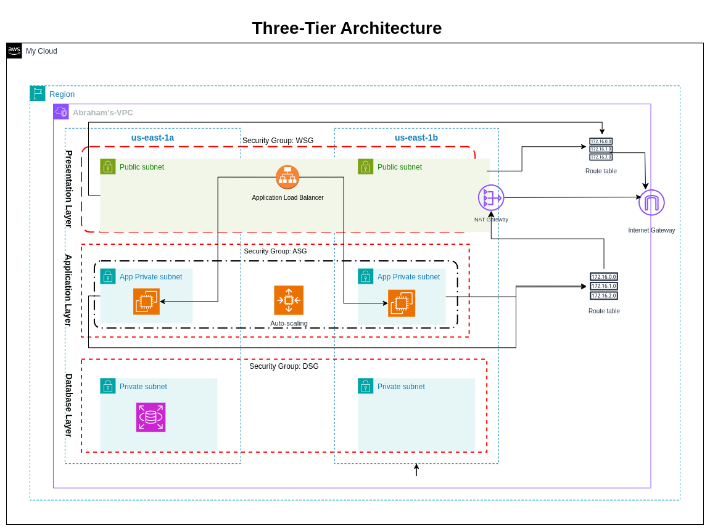
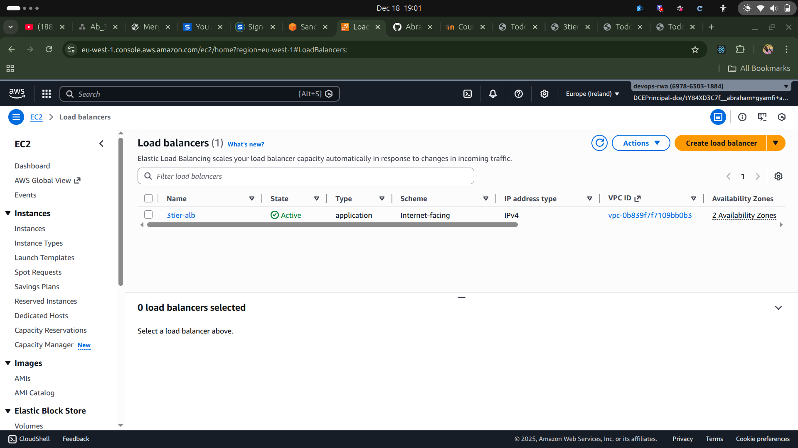
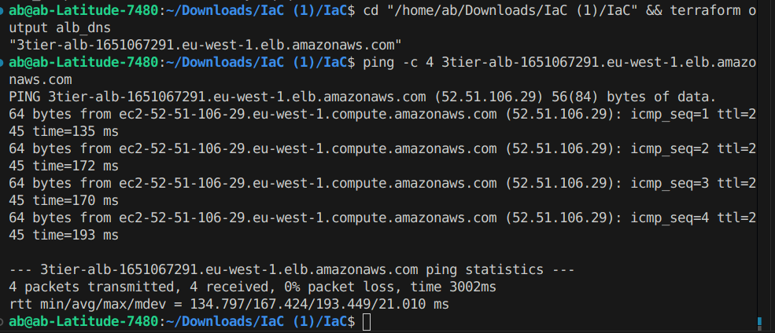
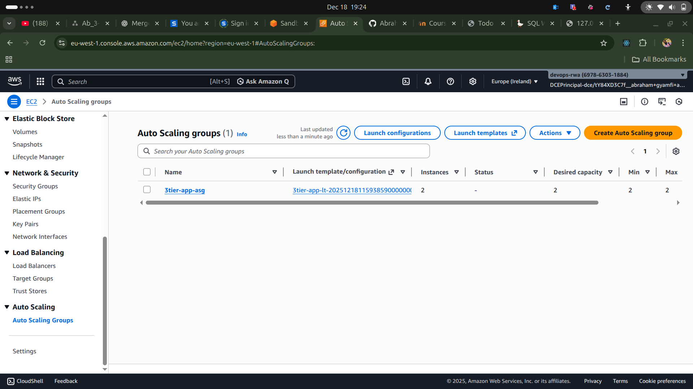
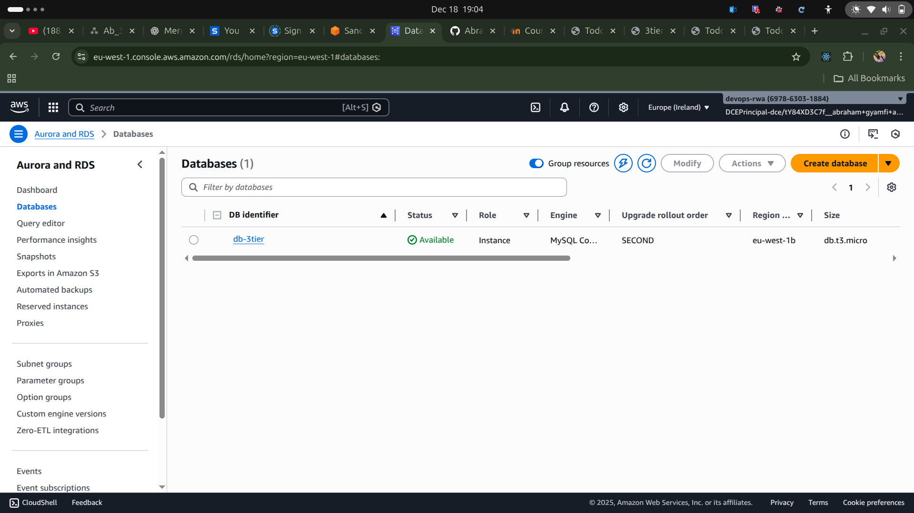
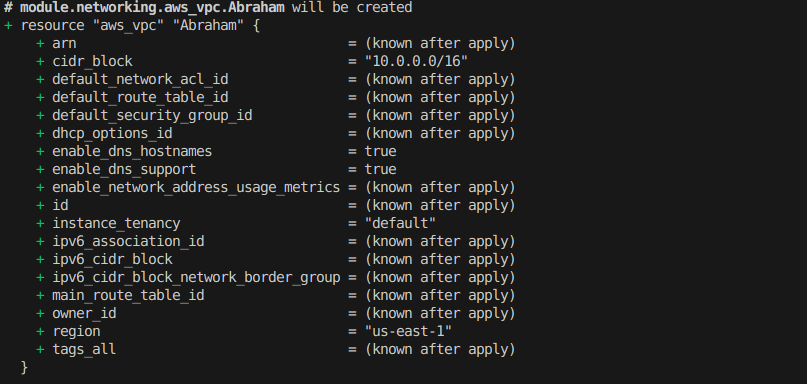
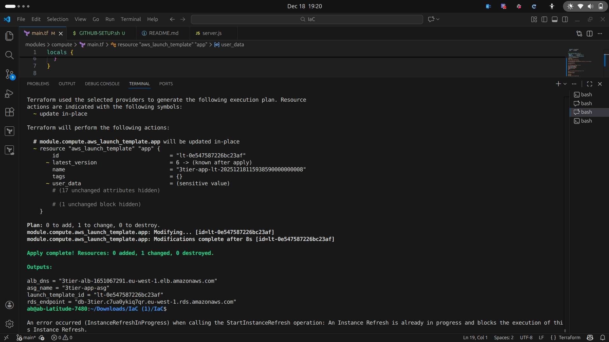

# 3-Tier AWS Architecture with Terraform Modules

## Architecture Overview

This project provisions a 3-tier AWS architecture using only Terraform native modules (no registry modules):

- **Presentation Layer:**
  - Application Load Balancer (ALB) in public subnets
- **Application Layer:**
  - EC2 instance (t3.micro) in private app subnets
- **Data Layer:**
  - RDS MySQL (t3.micro) in private DB subnets

All resources are parameterized, tagged, and region-restricted (eu-west-1, eu-central-1, us-east-1).

---

## Architecture Diagram



---

## How It Works - Traffic Flow

### **Step-by-Step Traffic Flow**

```
Internet → Internet Gateway → ALB (Public Subnets) → EC2 App Servers (Private Subnets) → RDS MySQL (Private DB Subnets)
```

1. **User Request Enters**
   - External user sends HTTP/HTTPS request
   - Traffic enters through **Internet Gateway (IGW)**

2. **Presentation Layer (Public)**
   - **Application Load Balancer (ALB)** in public subnets receives traffic
   - ALB protected by **Web Security Group** (allows ports 80/443 from internet)
   - ALB performs health checks and load balancing across AZs

3. **Application Layer (Private)**
   - ALB forwards traffic to **EC2 instances (t3.micro)** in private app subnets
   - EC2 protected by **App Security Group** (only accepts traffic from ALB)
   - Application processes request and queries database

4. **Data Layer (Private)**
   - EC2 connects to **RDS MySQL** in private DB subnets
   - RDS protected by **DB Security Group** (only port 3306 from App tier)
   - Database returns data to application

5. **Response Path**
   - Data flows back:  RDS → EC2 → ALB → IGW → User

6. **Outbound Internet Access**
   - Private subnets route outbound traffic through **NAT Gateway**
   - NAT Gateway in public subnet enables updates/patches
   - No inbound connections allowed from internet

### **Security Design**
- **3 isolated layers**:  Public → Private App → Private DB
- **Defense in depth**: Security groups at each tier allow only necessary traffic
- **Multi-AZ**:  All components span 2 Availability Zones for high availability
- **Zero trust**: Each layer only trusts the layer directly above it

### **Key Benefits**
✅ Scalable and fault-tolerant  
✅ Database never exposed to internet  
✅ Application servers in private subnets  
✅ Load balancing across multiple AZs  
✅ Secure, production-ready architecture

---

## Folder Structure

```
IaC/
├── main.tf
├── provider.tf
├── variables.tf
├── outputs.tf
├── modules/
│   ├── networking/
│   ├── security/
│   ├── alb/
│   ├── compute/
│   └── database/
```

---

## Deployment Instructions

1. **Clone the repository**
2. **Configure AWS credentials** (export AWS_PROFILE or set up credentials file)
3. **Edit `variables.tf`** to set your preferred region, owner, and DB password
4. **Run Terraform**:
   ```sh
   terraform init
   terraform plan
   terraform apply
   ```

---

## Module Descriptions

- **networking:** VPC, 2 public subnets, 2 private app subnets, 2 private DB subnets, IGW, NAT, route tables
- **security:** 3 security groups (web, app, db) with correct rules
- **alb:** Application Load Balancer, listener, target group
- **compute:** EC2 instance (t3.micro, Amazon Linux 2)
- **database:** RDS MySQL (t3.micro), DB subnet group

---

## Variables

See each module's `variables.tf` for all options. Key root variables:
- `aws_region` (must be eu-west-1, eu-central-1, or us-east-1)
- `owner` (for tagging)
- `db_password` (set a secure password)

---

## Outputs

- `alb_dns`: ALB DNS name
- `rds_endpoint`: RDS endpoint
- `instance_id`: EC2 instance ID

---

## Screenshots

### ALB in AWS Console


### Successful ICMP (ping) from ALB target or bastion


### EC2/ASG in AWS Console


### Application Connected to Database


### RDS in AWS Console


### VPC/Subnets in AWS Console


### Output from `terraform apply`


---

## Notes
- All modules are reusable and parameterized
- Only allowed regions and t3.micro instance types are used
- Tagging follows: `Environment`, `Project`, `Owner`
